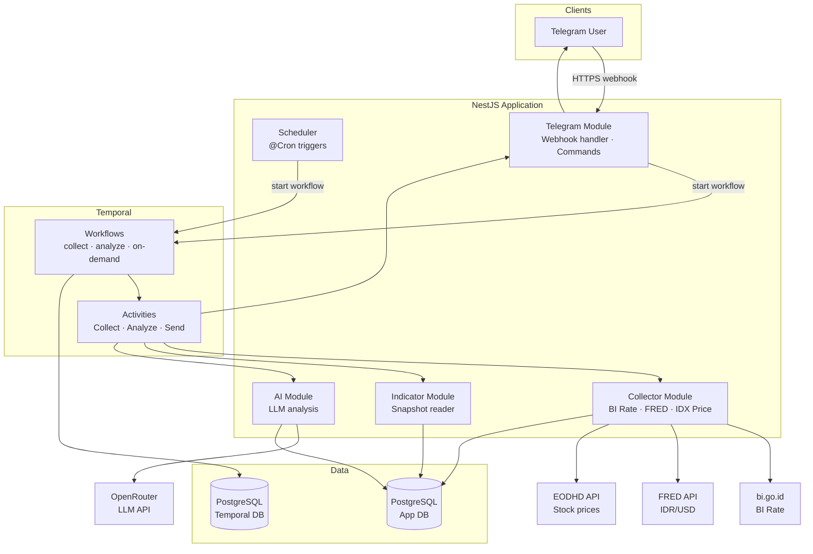
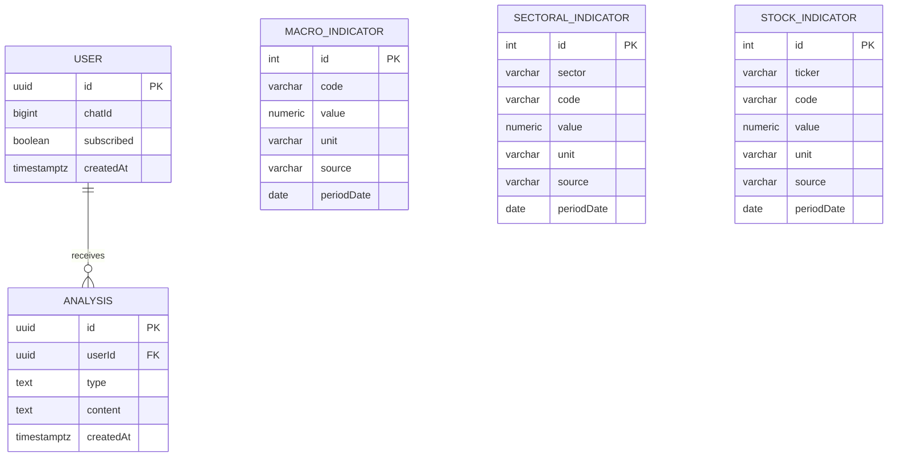

# Technical Architecture
# Investment Advisor Agent

---

## 1. Executive Summary

Investment Advisor Agent is a Telegram bot that delivers AI-generated daily and weekly investment digests for two Indonesian stocks — BBCA and ERAA — to subscribed users. It solves the problem of fragmented, manual research across disparate sources (Bank Indonesia, FRED, IDX) by automating collection, analysis, and delivery in a single pipeline. The two most consequential architectural choices are Temporal for durable workflow orchestration — ensuring paid LLM calls are never re-executed after a delivery failure — and a single PostgreSQL instance shared by both the application and Temporal, keeping infrastructure minimal for a solo-operator deployment. This document is intended as the authoritative reference for developers contributing to or extending the codebase.

---

## 2. Goals & Constraints

### Functional Requirements

- Users can subscribe and unsubscribe via Telegram `/start` and `/stop` commands.
- Subscribed users receive a daily digest automatically at 07:00 WIB on trading days (Monday–Friday).
- Subscribed users receive a weekly top-down analysis every Saturday at 08:00 WIB.
- Users can request an on-demand analysis via `/analyze`.
- Users can view the latest raw indicator values via `/latest`.
- If delivery fails after all retries, the user receives an error notification.

### Non-Functional Requirements

- Availability: system should survive VM restarts without losing in-progress workflow state.
- Latency: on-demand analysis response delivered within 5 minutes of `/analyze` command.
- Throughput: designed for a small subscriber base; no horizontal scaling required.
- Cost: LLM spend minimized by batching all indicators per ticker into one call and feeding stored daily analyses (not raw indicators) into the weekly synthesis.

### Constraints

- All services run on a single VM; no Kubernetes or managed cloud services.
- Telegram bot operates in webhook mode; polling is not used.
- LLM provider must expose an OpenAI-compatible API (`/v1/chat/completions`).
- Temporal requires a separate PostgreSQL database on the same instance.
- TypeScript / NestJS are fixed technology choices.

---

## 3. System Overview

The Telegram webhook is the only public entry point; all other components communicate over a private Docker network.



Inbound Telegram messages arrive at the webhook, which either handles them as bot commands directly or triggers a Temporal workflow via the workflow client. The Scheduler fires cron-based workflows on fixed schedules. Activities inside those workflows call into the application's service layer — Collectors write indicator data to PostgreSQL, the Indicator service reads it back as a snapshot, the AI service sends it to the LLM and stores the resulting analysis, and the Send activity delivers the formatted message to the user via Telegram.

---

## 4. Component Breakdown

### Scheduler

The Scheduler owns cron-based workflow triggers. It holds no business logic; its sole responsibility is to call `TemporalService.startWorkflow()` with the correct workflow name, ID, and task queue at the configured schedule.

| Cron | Expression | Workflow triggered |
|------|------------|--------------------|
| Daily collect + analyze | `0 7 * * 1-5` (WIB) | `collectDailyWorkflow` |
| Weekly collect | `0 8 * * 1` (WIB) | `collectWeeklyWorkflow` *(planned)* |
| Monthly collect | `0 8 2 * *` (WIB) | `collectMonthlyWorkflow` *(planned)* |
| Weekly analysis | `0 8 * * 6` (WIB) | `analyzeWeeklyWorkflow` *(planned)* |

### Collector Module

The Collector module owns fetching external indicator data and persisting it. Each collector implements `ICollector`, which returns `IndicatorPayload[]`. `CollectorService` orchestrates upsert into the appropriate table.

Currently implemented collectors:

| Collector | Source | Indicator codes |
|-----------|--------|-----------------|
| `BiRateCollector` | bi.go.id (HTML scrape) | `BI_RATE` |
| `FredCollector` | FRED REST API | `IDR_USD` |
| `IdxPriceCollector` | EODHD REST API | `PRICE_BBCA`, `PRICE_ERAA` |

Planned collectors (not yet implemented): IKK, BPS (GDP, CPI), OJK-SPI (banking sectoral), IPR (retail sectoral), IDX financial reports.

### Indicator Module

The Indicator module owns reading the latest persisted indicator values. Its single public method, `getLatestSnapshot()`, returns an `IndicatorSnapshot` containing the most recent value for every code across the macro, sectoral, and stock tables. This snapshot is the input to the AI analysis step.

### AI Module

The AI module owns LLM interaction. It calls an OpenAI-compatible API (`LLM_BASE_URL`) using `@ai-sdk/openai`. Two methods are defined: `analyzeStock(ticker, snapshot)` for per-ticker daily analysis, and `generateWeeklySummary(analyses[])` for the weekly narrative. **Both are currently stubs**; they throw `Error('not yet implemented')` and will be completed in the next implementation phase.

Model selection is environment-driven: `MODEL_FAST` is used for daily stock analysis (cost-optimized), `MODEL_SMART` for weekly synthesis (quality-optimized). The provider is configured via `LLM_BASE_URL`, keeping the implementation decoupled from any specific vendor. Default configuration targets Fireworks AI, accessed through a Tailscale Aperture gateway.

### Telegram Module

The Telegram module owns bot command handling and outbound message delivery. Telegraf is configured in webhook mode; NestJS exposes `POST /telegram/webhook`. Commands currently handled: `/start`, `/stop`, `/help`. Commands `/analyze` and `/latest` are documented in the help text but not yet wired to handlers. `sendMessage()` and `sendErrorNotification()` are called by the Send activity to push content to users.

### Temporal Module

The Temporal module owns workflow orchestration. It includes three components: `TemporalService` (the workflow client, used by Scheduler and Telegram to start workflows), `TemporalWorkerService` (registers all activities against the task queue and runs the worker), and three activity classes (`CollectActivity`, `AnalyzeActivity`, `SendActivity`) that delegate to the service layer.

Workflows live in `src/temporal/workflows/` and are pure TypeScript — no NestJS imports, only `proxyActivities()` calls. Currently implemented workflows: `collectDailyWorkflow`, `analyzeDailyWorkflow`, `onDemandAnalysisWorkflow`. A debug controller at `POST /debug/collect-daily` and `POST /debug/analyze/:chatId` enables manual workflow triggering during development.

---

## 5. Domain Model



**Relationships.** A `User` has many `Analysis` records over time; each `Analysis` is scoped to a single user and carries a `type` of either `daily` or `weekly`. Indicator tables have no foreign keys — they are append-only time-series and are read independently by the Indicator service when building a snapshot.

**Business Rules & Invariants**

- A `User` is uniquely identified by their Telegram `chatId`. Re-subscribing with `/start` must not create a duplicate record — it upserts `subscribed = true`.
- Digest delivery to a user requires `subscribed = true`. Users with `subscribed = false` are excluded from all workflow fan-outs.
- Each `(code, periodDate)` pair in `macro_indicators` is unique; same uniqueness applies to `(sector, code, periodDate)` in sectoral and `(ticker, code, periodDate)` in stock. Collectors upsert, never insert blindly.
- An `Analysis` record is written only after the LLM call succeeds. A failed analysis produces no record.
- Weekly analysis reads stored daily `Analysis` records for the current week — it never re-fetches raw indicators. If fewer than five daily analyses exist (e.g. due to holidays or failures), the weekly synthesis proceeds with however many are available.

---

## 6. Data Architecture

### Core Entities

```
users
  id           (uuid, PK)
  chat_id      (bigint, unique)
  subscribed   (boolean, default true)
  created_at   (timestamptz)

macro_indicators
  id           (serial, PK)
  code         (varchar 50)          -- 'BI_RATE', 'IDR_USD'
  value        (numeric 18,4)
  unit         (varchar 20, nullable)
  source       (varchar 50)          -- 'bi.go.id', 'FRED'
  period_date  (date)
  fetched_at   (timestamptz)
  unique: (code, period_date)

sectoral_indicators
  id           (serial, PK)
  sector       (varchar 50)          -- 'banking', 'retail_tech'
  code         (varchar 50)
  value        (numeric 18,4)
  unit         (varchar 20, nullable)
  source       (varchar 50)
  period_date  (date)
  fetched_at   (timestamptz)
  unique: (sector, code, period_date)

stock_indicators
  id           (serial, PK)
  ticker       (varchar 10)          -- 'BBCA', 'ERAA'
  code         (varchar 50)          -- 'PRICE_BBCA'
  value        (numeric 18,4)
  unit         (varchar 20, nullable)
  source       (varchar 50)
  period_date  (date)
  fetched_at   (timestamptz)
  unique: (ticker, code, period_date)

analyses
  id           (uuid, PK)
  user_id      (uuid, FK → users, SET NULL on delete)
  type         (text)                -- 'daily' | 'weekly'
  content      (text)
  created_at   (timestamptz)
```

### Storage Technology Choices

PostgreSQL is the sole data store for the application. It holds the indicator time-series, user subscriptions, and analysis history. The relational model is chosen for its UNIQUE constraint support — the upsert pattern on `(code, period_date)` requires database-level uniqueness guarantees that a document store cannot provide without application-level locking. A second PostgreSQL database (`temporal`) on the same instance hosts Temporal's internal state. Sharing one Postgres container for both databases eliminates a separate dependency while keeping their data namespaces isolated.

### Data Flow

A scheduled or on-demand collection begins when the Scheduler (or the debug controller) calls `TemporalService.startWorkflow()`. The Temporal worker picks up the `collectDailyWorkflow` task and executes `CollectActivity` methods sequentially: each collector makes an external HTTP request, parses the response, and calls `CollectorService.upsertMacro()` or `upsertStock()`, which performs a find-then-update-or-insert against PostgreSQL. Only after all collection activities complete does the workflow spawn `analyzeDailyWorkflow` as a child per subscribed user, guaranteeing fresh indicator data is present before any read. The analyze workflow calls `IndicatorService.getLatestSnapshot()` — a set of `DISTINCT ON` queries returning the most recent value per code — passes the snapshot to `AIService.analyzeStock()`, saves the resulting text to the `analyses` table, then delivers it via Telegram.

---

## 7. Key Architectural Decisions

| Decision | Choice | Rationale |
|----------|--------|-----------|
| Workflow engine | Temporal | Each pipeline step (collect, analyze, send) can fail independently. Temporal checkpoints after each activity — an LLM analysis that completes but fails to send resumes at the send step, not from scratch. Paid LLM calls are never re-run on delivery failures. |
| Workflow engine DB | PostgreSQL (shared instance) | Temporal supports PostgreSQL natively. Using the same Postgres container as the app avoids a Redis or separate Temporal-DB container, keeping the single-VM footprint small. |
| Cron trigger placement | NestJS `@Cron()` (Scheduler module) | Five fixed expressions are simpler to reason about and debug in NestJS than Temporal Schedules. Temporal Schedules add value if per-user schedule customization is needed; that is out of scope. |
| Telegram bot mode | Webhook (not polling) | Webhook is mandatory for production deployments on a public server; it eliminates long-polling overhead and integrates naturally with the existing HTTPS reverse proxy. |
| LLM provider | OpenAI-compatible API via `@ai-sdk/openai` | Using an OpenAI-compatible interface means the provider can be swapped by changing `LLM_BASE_URL` without touching code. `MODEL_FAST` / `MODEL_SMART` separation lets cost and quality be tuned independently per analysis type. Default provider is Fireworks AI via Tailscale Aperture. |
| Weekly analysis input | Stored daily analyses, not raw indicators | Raw indicator sets for a week of BBCA + ERAA would be large. Stored daily analyses are already compressed summaries. Reading up to five text analyses for the weekly synthesis is significantly cheaper and feeds the LLM more signal per token. |
| Schema synchronization | TypeORM `synchronize: true` in non-production | Eliminates migration friction during development. Disabled in production to prevent uncontrolled schema mutations. |

---

## 8. Security & Compliance

**Secrets management.** All secrets (database credentials, API keys, Telegram bot token, LLM API key) are injected at runtime via environment variables from a `.env` file on the host. The `.env` file is git-ignored. In production, the `.env` file should be provisioned by the operator and never committed. `ConfigService.getOrThrow()` is used for required secrets so the application fails fast on startup if a secret is missing.

**Transport security.** All external API calls are made over HTTPS. The Telegram webhook endpoint must be served over HTTPS; this is delegated to Nginx Proxy Manager, which handles TLS certificate provisioning and renewal automatically via Let's Encrypt.

**Bot authentication.** Telegram validates webhook authenticity by requiring a bot token that only Telegram and the operator know. No additional webhook secret header is currently configured; adding a `secret_token` to the `setWebhook` call is recommended before production.

**Data protection.** No personally identifiable information beyond Telegram chat IDs is stored. Chat IDs are not considered sensitive by Telegram's terms of service but should be treated with care. The database is not exposed publicly; it is accessible only within the Docker private network.

---

## 9. Observability

**Logging.** The application uses NestJS's built-in `Logger`, which writes plain-text log lines to stdout. Each service and activity class instantiates its own logger with the class name as context. Production log shipping (to a centralized store) is not yet configured.

**Metrics.** No metrics instrumentation is in place. For this single-VM, low-traffic deployment, Temporal UI (accessible on port 8080 in a full-stack setup) provides the primary operational view — workflow execution history, activity retry counts, and failure reasons are all visible there without additional instrumentation.

**Tracing.** No distributed tracing is configured.

**Alerting.** No automated alerting is configured. The most operationally important signal for this system is Temporal workflow failure rate — a spike indicates either an external API outage (collector failures) or LLM availability issues (analyze failures). Monitoring the Temporal UI's failed workflow count is the primary manual check.

---

## 10. Error Handling Conventions

Temporal activities throw exceptions on failure; the framework handles retries according to the configured retry policy. Workflows catch unhandled exceptions in a top-level `try/catch` and call `sendErrorNotification` as a best-effort fallback — errors from the notification itself are swallowed silently to prevent secondary failures from propagating.

```typescript
// Workflow-level error boundary (analyze.workflow.ts)
export async function analyzeDailyWorkflow(chatId: number): Promise<void> {
  try {
    const snapshot = await fetchLatestIndicators();
    const text = await analyzeStocks(chatId, snapshot);
    await sendTelegramMessage(chatId, text);
  } catch (err) {
    await sendErrorNotification(chatId, err instanceof Error ? err.message : String(err));
  }
}

// Activity-level: swallow secondary failure
async sendErrorNotification(chatId: number, error: string): Promise<void> {
  try {
    await this.telegramService.sendErrorNotification(chatId);
  } catch (e) {
    this.logger.error(`sendErrorNotification failed silently: ${e}`);
    // swallow — secondary failure must not propagate
  }
}
```

Rules:
- Activities must throw on failure; they must not return null or a sentinel value to indicate failure.
- Workflows must not leak exceptions to the Temporal engine for user-facing errors — catch and notify instead.
- The error notification send activity must never throw; swallow all errors.
- Collectors that return zero payloads must log an error but not throw — an empty result is a valid (degraded) outcome that the workflow handles by proceeding with whatever data is already in the database.

---

## 11. Testing Expectations

Unit tests cover activity classes and service-layer logic; workflow files are tested with Temporal's `@temporalio/testing` test environment, which replays workflow execution without a live server.

**What to test:**
- Activity methods: assert the correct service method is called with the correct arguments.
- Collector parsers: assert that known HTML/JSON fixtures produce the expected `IndicatorPayload[]` output.
- `IndicatorService.getLatestSnapshot()`: assert correct SQL query construction and result mapping.
- Workflows: assert correct activity call sequence using Temporal's workflow test environment.

**Setup pattern** (NestJS unit test for an activity):

```typescript
describe('CollectActivity', () => {
  let activity: CollectActivity;
  let collectorService: jest.Mocked<CollectorService>;

  beforeEach(async () => {
    const module = await Test.createTestingModule({
      providers: [
        CollectActivity,
        { provide: CollectorService, useValue: { collectBiRate: jest.fn() } },
        { provide: getRepositoryToken(User), useValue: { find: jest.fn() } },
      ],
    }).compile();

    activity = module.get(CollectActivity);
    collectorService = module.get(CollectorService);
  });

  it('delegates to collectorService.collectBiRate', async () => {
    collectorService.collectBiRate.mockResolvedValue(undefined);
    await activity.collectBiRate();
    expect(collectorService.collectBiRate).toHaveBeenCalledOnce();
  });
});
```

**File location.** Unit test files are co-located with the source file they test, named `*.spec.ts`. End-to-end tests live in `test/`.

**Coverage.** No hard coverage threshold is enforced. All activity methods and workflow step sequences must have tests; pure data-transformation functions in collectors (parsers) must have tests against real fixture data.

---

## 12. Appendix: Project Structure

```
src/
├── main.ts                              # Application bootstrap
├── app.module.ts                        # Root module, TypeORM and global config
├── database/
│   └── entities/
│       ├── user.entity.ts
│       ├── macro-indicator.entity.ts
│       ├── sectoral-indicator.entity.ts
│       ├── stock-indicator.entity.ts
│       └── analysis.entity.ts
├── modules/
│   ├── scheduler/
│   │   ├── scheduler.module.ts
│   │   └── scheduler.service.ts         # @Cron() → TemporalService.startWorkflow()
│   ├── collector/
│   │   ├── collector.module.ts
│   │   ├── collector.service.ts         # Upsert orchestrator
│   │   ├── collector.interface.ts       # ICollector, IndicatorPayload
│   │   ├── macro/
│   │   │   ├── bi-rate.collector.ts     # Scrapes bi.go.id
│   │   │   └── fred.collector.ts        # FRED REST API (IDR/USD)
│   │   └── stock/
│   │       └── idx-price.collector.ts   # EODHD API (BBCA, ERAA prices)
│   ├── indicator/
│   │   ├── indicator.module.ts
│   │   └── indicator.service.ts         # getLatestSnapshot() → IndicatorSnapshot
│   ├── ai/
│   │   ├── ai.module.ts
│   │   └── ai.service.ts                # LLM calls (stubs; not yet implemented)
│   └── telegram/
│       ├── telegram.module.ts
│       ├── telegram.controller.ts       # POST /telegram/webhook
│       └── telegram.service.ts          # Command handlers, sendMessage
└── temporal/
    ├── temporal.module.ts
    ├── temporal.service.ts              # WorkflowClient wrapper
    ├── temporal-worker.service.ts       # Registers activities, runs worker
    ├── temporal.controller.ts           # POST /debug/* — manual workflow triggers
    ├── temporal.types.ts                # IndicatorSnapshot, activity interfaces
    ├── workflows/
    │   ├── index.ts                     # Re-exports for worker bundler
    │   ├── collect.workflow.ts          # collectDailyWorkflow
    │   └── analyze.workflow.ts          # analyzeDailyWorkflow, onDemandAnalysisWorkflow
    └── activities/
        ├── collect.activity.ts          # Delegates to CollectorService
        ├── analyze.activity.ts          # Delegates to IndicatorService + AIService
        └── send.activity.ts             # Delegates to TelegramService
```

---

*This document should be reviewed and updated on any major architectural change.*
